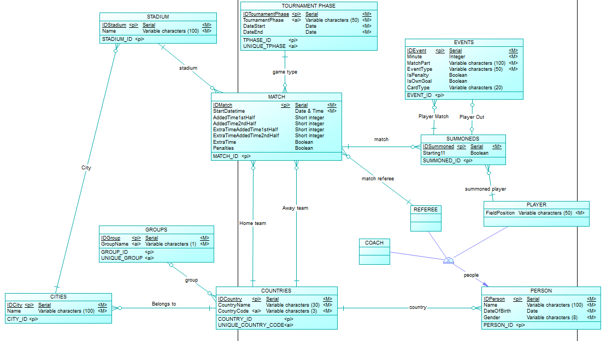
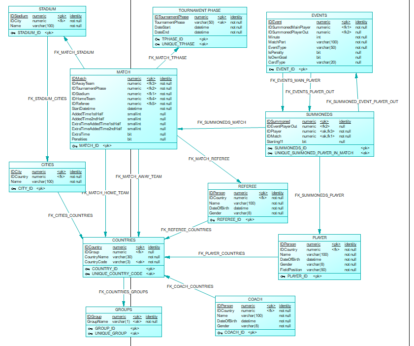

# Women’s World Cup Database Project

## Project Overview
This project focuses on designing and implementing a robust database to manage and store data related to the Women’s World Cup. The database captures information about teams, players, referees, matches, events, and stages of the tournament. The work was divided into two parts: creating a conceptual and physical data model, and implementing integrity and business rules.

## Objective
The objectives of this project were:
1. Develop a comprehensive data model to store all relevant information about the Women’s World Cup.
2. Implement integrity and business rules to ensure data consistency and enforce tournament-specific constraints.
3. Create a database capable of handling complex operations, such as tracking player participation, match events, and referee assignments.

## Problem Statement
Managing the complex structure of a global tournament like the Women’s World Cup involves numerous challenges:
- Storing detailed data about matches, teams, players, and events.
- Ensuring compliance with tournament rules, such as referee-country restrictions and player substitution constraints.
- Handling real-time updates like goals, cards, and substitutions without compromising data integrity.

## What Was Done
### Part I: Data Modeling
1. **Conceptual Data Model**:
   - Designed an Entity-Relationship (ER) model in Power Designer to represent entities such as Teams, Players, Matches, Referees, Events, and Stages.
   - Defined relationships and constraints, such as team group assignments and match participation.
2. **Physical Data Model**:
   - Transformed the ER model into a relational model optimized for Microsoft SQL Server.
   - Generated SQL scripts to create database tables and relationships.
3. **SQL Implementation**:
   - Created tables with primary and foreign keys to enforce referential integrity.
   - Delivered SQL scripts for table creation and data constraints.

     
   *Figure: Conceptual Data Model*

     
   *Figure: Physical Data Model*   

### Part II: Business and Integrity Rules
1. **Rules Implementation**:
   - **Player Summoning**: Ensured players summoned to a match belong to participating teams.
   - **Referee Assignment**: Restricted referees from officiating matches involving their home country.
   - **Match Events**:
     - Automatically issued red cards for players receiving two yellow cards in the same match.
     - Verified players scoring goals were actively on the field.
     - Enforced substitution constraints (e.g., player roles and team alignment).
2. **Trigger and Procedure Development**:
   - Developed triggers to enforce rules dynamically during data operations.
   - Created stored procedures and functions for batch data validation.
3. **Testing and Optimization**:
   - Tested the rules against individual and batch operations.
   - Ensured correct rows were processed while rejecting invalid ones without rollback penalties.

## Key Features
- **Detailed Match Tracking**:
  - Tracks goals, cards, substitutions, and penalties for every match.
- **Tournament Phases**:
  - Records group stages and knockout rounds, including match-specific data like added time and penalties.
- **Enforced Rules**:
  - Real-time validation of tournament constraints to maintain data accuracy and integrity.

## Conclusions
This project demonstrates the importance of a well-structured database for managing a complex event like the Women’s World Cup. By combining advanced data modeling and business rule enforcement, the database ensures reliable data handling and compliance with tournament regulations. The final implementation provides a robust foundation for future enhancements, such as real-time data updates and advanced analytics.
